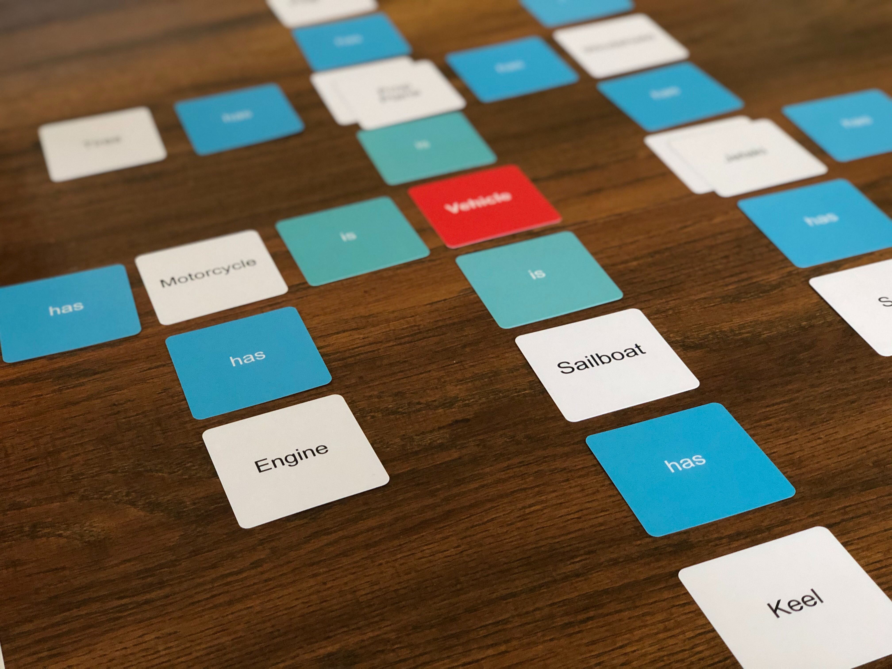

# Objects Card Game
This card game is an introduction to Object-Oriented Programming, used in Computer Science, for ages +5 years and up.

The goal was to teach STEM related topics without the typical “privileged” assumptions, like access to a computer, an internet connection, while also reducing screen time.

We then focused on developing an engaging card game around data hierarchy targeting the 5– 8-year-old demographic. When researching opportunities, we used the 2017 Wisconsin Computer Science Standards report and found that teaching goals in 5–8 were:

> _DA2.b.1.e: Sort objects into buckets, recognizing relevant and/or irrelevant data (e.g., one of these things is not like the other).: [2017 Wisconsin Computer Science Standards](https://dpi.wi.gov/sites/default/files/imce/computer-science/computersciencestandardsfinaladopted.pdf)_

We feel that we're on the path of a fun project between kids and parents but we're lacking in game mechanics. Because of the current "Shelter in Place' requirements being enforced around the country we're chosing to Open Source this effort so that we can make changes and build on this game together while we're stuck inside.

## Making your own
Soon I'll be posting a link to a company that you can directly order a deck from and have delivered to your door. Additionally, early prototypes were used by ordering blank decks of cards online and then writing in the names on each card.
