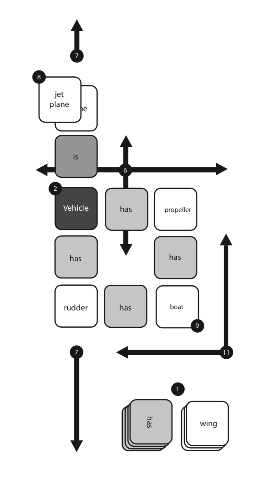

# ObjectsCardGame
This card game is an introduction to Object-Oriented Programming, used in Computer Science, for ages +5 years and up.

The cards are organized as Objects: Generic (Boat), Objects: Instances (Sailboat), Containment (Has) and Associations (Is).
Association defines a relationship between classes of objects that allows one object instance to cause another to perform an action on its behalf. This relationship is structural, because it specifies that objects of one kind are connected to objects of another and does not represent behavior.

## Setup/Play:
1. The deck is separated into two (2) piles: Object and Has/Is stacks.
2. The [Vehicle] card is placed in the middle of the playing surface.
3. Each player takes 5 Object cards to start.
4. The first play starts with the Vehicle card. Player 1 takes a Has/Is card to use with one of the cards in their hand. - ex: [Vehicle] [Has] [Gas Tank] or [Vehicle] [Is] [Boat].
5. Once a card is played the player grabs another Object card from the top of the deck. Player 2 starts their turn.
6. Moves from the Vehicle card can be off any side (4 sides).
7. Play of cards can go into either direction, but a direction has to adhere to all associations in that direction - ex: [Vehicle] [has] [Gas Tank] [has] [Wheels] [is] [Car] - once [Car] is laid this direction would not allow associations like [Has] [Rudder]. Containments are logical, meaning an Object:Generic can’t [has] link to other Generics that it inherits. ex: [rudder] [has] [light] is not playable even if in the direction has a [boat] card.
8. Stacking - A player is able to place and Object: Instance over an Object: Generic in order to block certain cards being played - ex: placing the [Sailboat] card over the [Boat] card to restrict Object associations. Additionally, a Object: Generic can be placed under its shared Object: Instance.
9 In scoring play, a player is allowed to connect multiple directions with two Has/Is cards and 1 Object card.

## Scoring:
Scoring is up to the players. We’ve found different ages are motivated by group play and some like more competitive options, like below:

### Scoring Options:
10. Each Object association is 1 point.
11 Connecting 2 Objects from different directions to a new association is 4 points.
12. Instances are stacked on Generic objects to collect the original point x 2
13. The vehicle card is the only Object card that cannot be stacked on (come on, it would be over in no time otherwise).

### End of Deck Scoring:
Use all cards in the stack until either there are no more moves to make or either stack - Objects or Has/Is - have run out. Winner has the least number of cards in hand.

